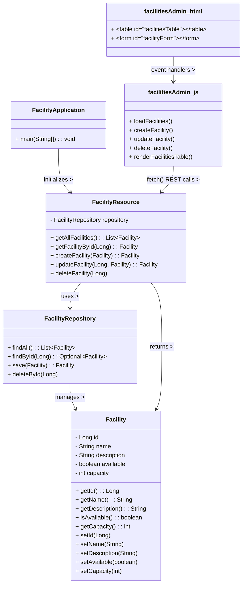

```mermaid
classDiagram
    title Facility Domain and Interaction Diagram

    %% ===== Domain Layer =====
    class Facility {
        - Long id
        - String name
        - String description
        - boolean available
        - int capacity
        + getId(): Long
        + getName(): String
        + getDescription(): String
        + isAvailable(): boolean
        + getCapacity(): int
        + setId(Long)
        + setName(String)
        + setDescription(String)
        + setAvailable(boolean)
        + setCapacity(int)
    }

    %% ===== Persistence Layer =====
    class FacilityRepository {
        + findAll(): List~Facility~
        + findById(Long): Optional~Facility~
        + save(Facility): Facility
        + deleteById(Long)
    }

    %% ===== Resource Layer =====
    class FacilityResource {
        - FacilityRepository repository
        + getAllFacilities(): List~Facility~
        + getFacilityById(Long): Facility
        + createFacility(Facility): Facility
        + updateFacility(Long, Facility): Facility
        + deleteFacility(Long)
    }

    %% ===== Application Layer =====
    class FacilityApplication {
        + main(String[]): void
    }

    %% ===== Frontend Layer =====
    class facilitiesAdmin_js {
        + loadFacilities()
        + createFacility()
        + updateFacility()
        + deleteFacility()
        + renderFacilitiesTable()
    }

    class facilitiesAdmin_html {
        + <table id="facilitiesTable">
        + <form id="facilityForm">
    }

    %% ===== Relationships =====
    FacilityRepository --> Facility : manages >
    FacilityResource --> FacilityRepository : uses >
    FacilityResource --> Facility : returns >
    FacilityApplication --> FacilityResource : initializes >
    facilitiesAdmin_js --> FacilityResource : fetch() REST calls >
    facilitiesAdmin_html --> facilitiesAdmin_js : event handlers >
```