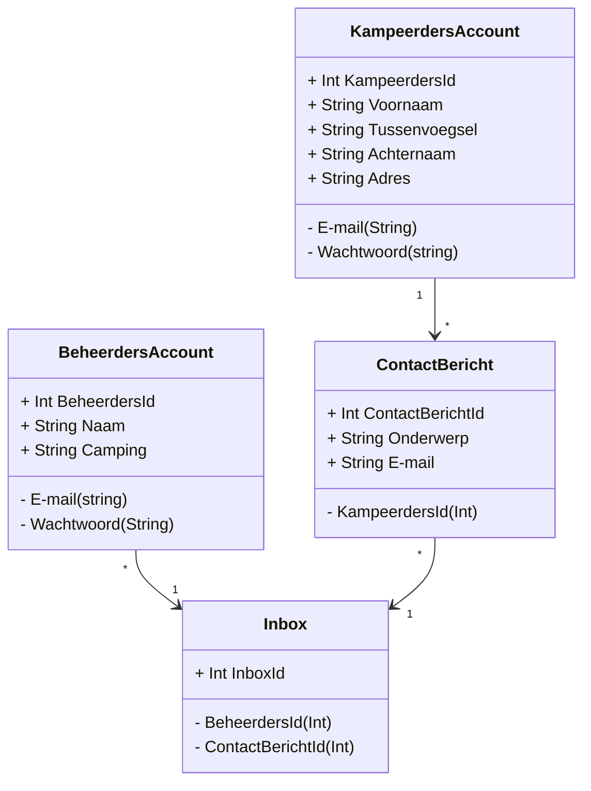

```mermaid

classDiagram
    class KampeerdersAccount{
        + Int KampeerdersId
        + String Voornaam
        + String Tussenvoegsel
        + String Achternaam
        + String Adres
        - E-mail (String)
        - Wachtwoord (string)
    }
    class BeheerdersAccount{
        + Int BeheerdersId
        + String Naam
        + String Camping
        - E-mail (string)
        - Wachtwoord (String)
    }
    class ContactBericht{
        + Int ContactBerichtId
        + String Onderwerp
        + String E-mail
        - KampeerdersId (Int)
    }
    class Inbox{
        + Int InboxId
        - BeheerdersId (Int)
        - ContactBerichtId (Int)
    }

    KampeerdersAccount "1" --> "*" ContactBericht
    BeheerdersAccount "*" --> "1" Inbox
    ContactBericht "*" --> "1" Inbox

```