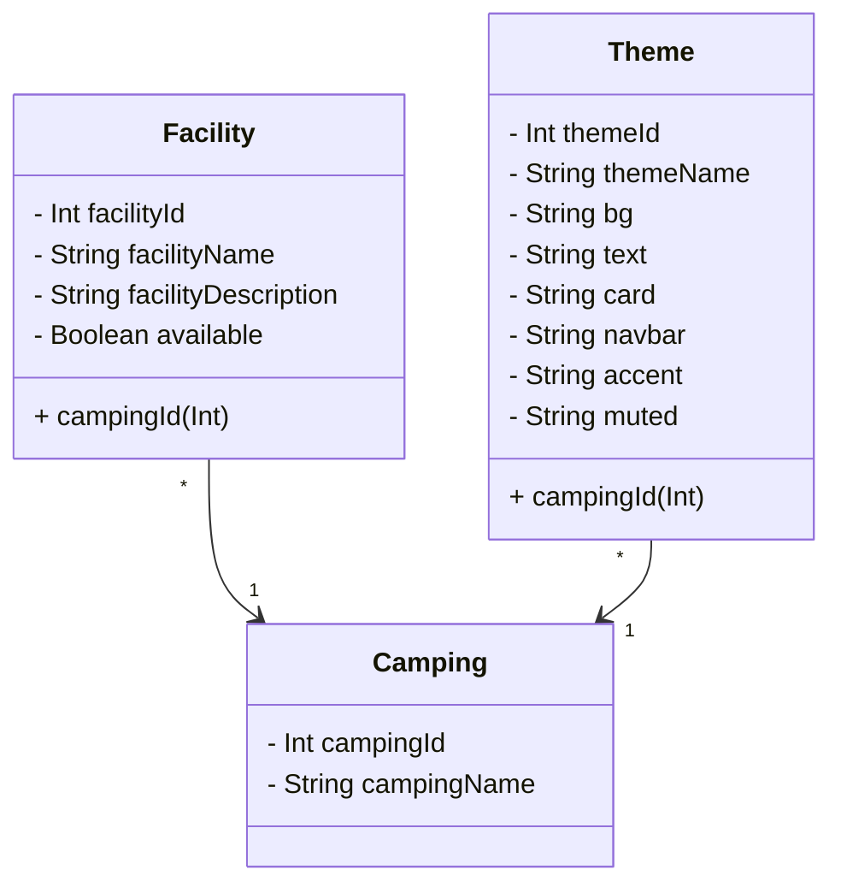

```mermaid
classDiagram
    class Facility {
        - Int facilityId
        - String facilityName
        - String facilityDescription
        - Boolean available
        + campingId(Int)
    }
    class Theme {
        - Int themeId
        - String themeName
        - String bg
        - String text
        - String card
        - String navbar
        - String accent
        - String muted
        + campingId(Int)
    }
    class Camping {
        - Int campingId
        - String campingName
    }

    Facility "*" --> "1" Camping
    Theme "*" --> "1" Camping
```