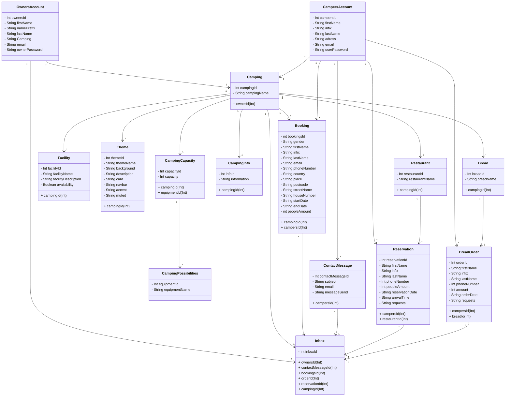

```mermaid

classDiagram
    class CampersAccount{
        - Int campersId
        - String firstName
        - String infix
        - String lastName
        - String adress
        - String email
        - String userPassword
    }
    class OwnersAccount{
        - Int ownersId
        - String firstName
        - String namePrefix
        - String lastName
        - String Camping
        - String email
        - String ownerPassword
    }
    class ContactMessage{
        - Int contactMessageId
        - String subject
        - String email
        - String messageSend
        + campersId (Int)
    }
    class Inbox{
        - Int inboxId
        + ownersId (Int)
        + contactMessageId (Int)
        + bookingsId (Int)
        + orderId (Int)
        + reservationId (Int)
        + campingId (Int)
    }
    class Camping {
        - Int campingId
        - String campingName
        + ownerId (Int)
    }
    class Booking {
        - int bookingsId
        - String gender
        - String firstName
        - String infix
        - String lastName
        - String email
        - String phoneNumber
        - String country
        - String place
        - String postcode
        - String streetName
        - String houseNumber
        - String startDate
        - String endDate
        - int peopleAmount
        + campingId (Int)
        + campersId (Int)
    }
    class Facility {
        - Int facilityId
        - String facilityName
        - String facilityDescription
        - Boolean availability
        + campingId(Int)
    }
    class Theme {
        - Int themeId
        - String themeName
        - String background
        - String description
        - String card
        - String navbar
        - String accent
        - String muted
        + campingId(Int)
    }
    class CampingPossibilities{
        - Int equipmentId
        - String equipmentName
    }
    class CampingCapacity{
        - Int capacityId
        - Int capacity
        + campingId (Int)
        + equipmentId (Int)
    }
    class CampingInfo{
        - Int infoId
        - String information
        + campingId (Int)
    }
    class Restaurant{
        - Int restaurantId
        - String restaurantName
        + campingId (Int)
    }
    class Reservation{
        - Int reservationId
        - String firstName
        - String infix
        - String lastName
        - Int phoneNumber
        - Int peopleAmount
        - String reservationDate
        - String arrivalTime
        - String requests
        + campersId (Int)
        + restaurantId (Int)
    }
    class Bread{
        - Int breadId
        - String breadName
        + campingId (Int)
    }
    class BreadOrder{
        - Int orderId
        - String firstName
        - String infix
        - String lastName
        - Int phoneNumber
        - Int amount
        - String orderDate
        - String requests
        + campersId (Int)
        + breadId (Int)
    }
    OwnersAccount "*" --> "1" Camping
    OwnersAccount "*" --> "1" Inbox
    Camping "1" --> "*" Booking
    CampersAccount "1" --> "*" Booking
    CampersAccount "*" --> "1" Camping
    CampersAccount "1" --> "*" Reservation
    CampersAccount "1" --> "*" ContactMessage
    CampersAccount "1" --> "*" BreadOrder
    Camping "1" --> "*" Facility
    Camping "1" --> "1" Inbox
    Booking "*" --> "1" Inbox
    ContactMessage "*" --> "1" Inbox
    Camping "1" --> "*" Theme
    Camping "*" --> "1" CampingCapacity
    CampingCapacity "1" --> "*" CampingPossibilities
    Camping "1" --> "1" CampingInfo
    Camping "1" --> "1" Restaurant
    Restaurant "1" --> "*" Reservation
    Reservation "*" --> "1" Inbox
    Camping "1" --> "*" Bread
    Bread "*" --> "1" BreadOrder
    BreadOrder "*" --> "1" Inbox
```