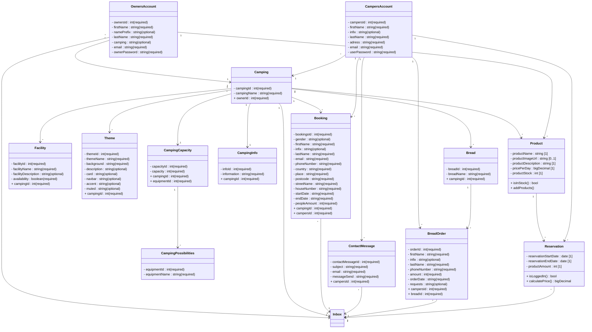

Korte uitleg van het domeinmodel

Dit domeinmodel beschrijft de belangrijkste onderdelen van het reserveringssysteem voor een campingplatform en hoe deze met elkaar verbonden zijn. Het model toont twee hoofdgebruikers: Camper (gast) en Owner (campingeigenaar). Een eigenaar beheert één of meerdere campings, die verschillende eigenschappen kunnen hebben, zoals faciliteiten, thema’s en capaciteiten.

Gasten kunnen bij campings boekingen plaatsen, reserveringen maken bij het restaurant en brood bestellen bij de bakkerij. Deze acties zijn opgenomen in de klassen Booking, Reservation en BreadOrder. Daarnaast bevat het model een Inbox voor berichten en aanvragen die eigenaren kunnen beheren.

Elke klasse bevat de relevante eigenschappen, zoals namen, datums, contactgegevens en aantallen personen. Het model laat ook zien welke gegevens verplicht zijn en hoe de objecten onderling verbonden zijn, bijvoorbeeld dat een camping meerdere boekingen kan hebben of dat een restaurant meerdere reserveringen ontvangt. Het doel is een overzichtelijk beeld van de informatie en interacties binnen het platform, zowel voor gasten als eigenaren.
