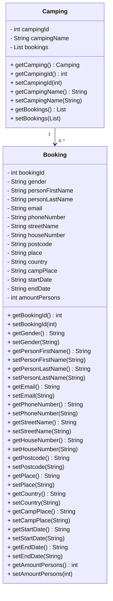

```mermaid
classDiagram
    class Camping {
        - int campingId
        - String campingName
        - List<Booking> bookings
        + getCamping() Camping
        + getCampingId() int
        + setCampingId(int)
        + getCampingName() String
        + setCampingName(String)
        + getBookings() List<Booking>
        + setBookings(List<Booking>)
    }
    class Booking {
        - int bookingId
        - String gender
        - String personFirstName
        - String personLastName
        - String email
        - String phoneNumber
        - String streetName
        - String houseNumber
        - String postcode
        - String place
        - String country
        - String campPlace
        - String startDate
        - String endDate
        - int amountPersons
        + getBookingId() int
        + setBookingId(int)
        + getGender() String
        + setGender(String)
        + getPersonFirstName() String
        + setPersonFirstName(String)
        + getPersonLastName() String
        + setPersonLastName(String)
        + getEmail() String
        + setEmail(String)
        + getPhoneNumber() String
        + setPhoneNumber(String)
        + getStreetName() String
        + setStreetName(String)
        + getHouseNumber() String
        + setHouseNumber(String)
        + getPostcode() String
        + setPostcode(String)
        + getPlace() String
        + setPlace(String)
        + getCountry() String
        + setCountry(String)
        + getCampPlace() String
        + setCampPlace(String)
        + getStartDate() String
        + setStartDate(String)
        + getEndDate() String
        + setEndDate(String)
        + getAmountPersons() int
        + setAmountPersons(int)
    }
    
    Camping "1" --> "0..*" Booking
```